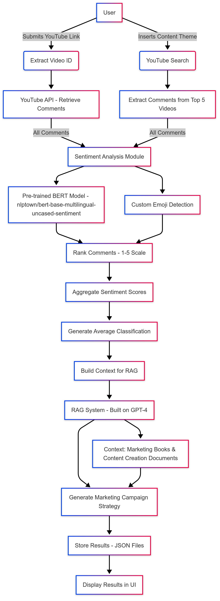

# YouTube Comments Sentiment Analysis

This project is a web application developed in Python using Flask that extracts comments from YouTube videos and performs sentiment analysis on them. The application processes the comments, assigns labels such as **EXCELLENT**, **AVERAGE**, **BAD**, and **TERRIBLE** to each comment, and presents an overall conclusion of the audience’s reaction. Additionally, based on the aggregated analysis, the application generates creative content suggestions specifically for TikTok using the OpenAI ChatCompletion API (leveraging a specialized marketing RAG on top of OpenAI’s “4th model”).

## Features

- **Comments Extraction:**  
  Utilizes the YouTube API to collect up to 2000 comments from a video.

- **Sentiment Analysis:**  
  Uses a pre-trained sentiment analysis model ([nlptown/bert-base-multilingual-uncased-sentiment](https://huggingface.co/nlptown/bert-base-multilingual-uncased-sentiment)) from Hugging Face to classify each comment from a range of 1 (very negative) to 5 (highly positive).  
  - **Custom Emoji Analysis:** Custom routine to better interpret comments mostly consisting of emojis.  
  - **Aggregation:** Computes an overall sentiment average from individual comment scores and generates a detailed analysis summary.

- **Content Suggestions (RAG + OpenAI):**  
  Harnesses a Retrieval-Augmented Generation workflow based on OpenAI’s “4th model,” which references a broad range of vectorized documents focusing on marketing sources. Generates at least three novel and creative content ideas tailored for social platforms such as TikTok, each with a brief explanation of how it addresses viewer sentiment.

- **Modern UI/UX:**  
  - A responsive web interface built with Flask and Bootstrap.  
  - A custom light-green toggle button to display or hide the analyzed comments.  
  - A results page showing an overall sentiment conclusion, creative content suggestions, and a collapsible section for individual comment analyses.  
  - Clear formatting of suggestions – newlines in the suggestions are converted to HTML `<br>` tags for improved readability.

## Requirements

- Python 3.7 or higher  
- Flask  
- google-api-python-client  
- transformers  
- torch  
- openai  

## Installation

1. Clone the repository:
   ```bash
   git clone https://github.com/your-username/youtube-comments-analysis.git
   cd youtube-comments-analysis
   ```
2. Create and activate a virtual environment (optional, but recommended):
   ```bash
   python -m venv venv
   source venv/bin/activate  # On Windows: venv\Scripts\activate
   ```
3. Install the dependencies:
   ```bash
   pip install -r requirements.txt
   ```
4. Configure your YouTube API Key:
   Create a file named `api_key.py` in the root of the project and insert:
   ```python
   API_KEY = "YOUR_API_KEY_HERE"
   OPENAI_API_KEY = "YOU_API_KEY_HERE"
   ```

## Usage

1. Run the application:
   ```bash
   python main.py
   ```
2. Access the application in your browser at http://127.0.0.1:5000/.
3. Enter the link of a YouTube video and submit the form to see the comment analysis and personalized conclusion.


## Architecture

The architecture of the YouTube Comments Sentiment Analysis application is illustrated in the following diagram:



The main components of the architecture are:

1. **YouTube API:**  
   Fetches comments from YouTube videos.

2. **Sentiment Analysis Module:**  
   Processes the comments using a pre-trained sentiment analysis model.

3. **Emoji Analysis Routine:**  
   Custom logic to interpret comments primarily composed of emojis.

4. **Aggregation Module:**  
   Computes the overall sentiment and generates a detailed analysis summary.

5. **Content Suggestion Module:**  
   Uses the OpenAI ChatCompletion API to generate TikTok content suggestions based on the sentiment analysis.

6. **Web Interface:**  
   Built with Flask and Bootstrap, it displays the results and suggestions to the user.

7. **Database:**  
   Stores the comments, sentiment scores, and generated content suggestions.

8. **User Interaction:**  
   Users interact with the application through a modern, responsive web interface.
